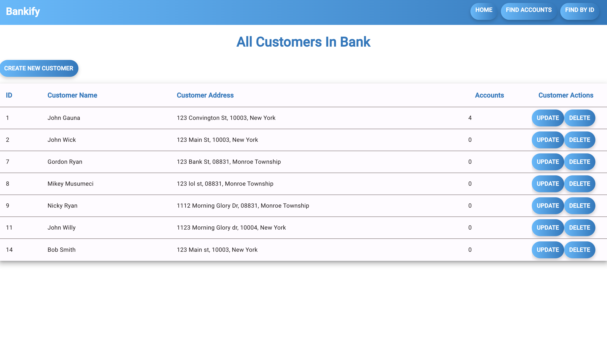
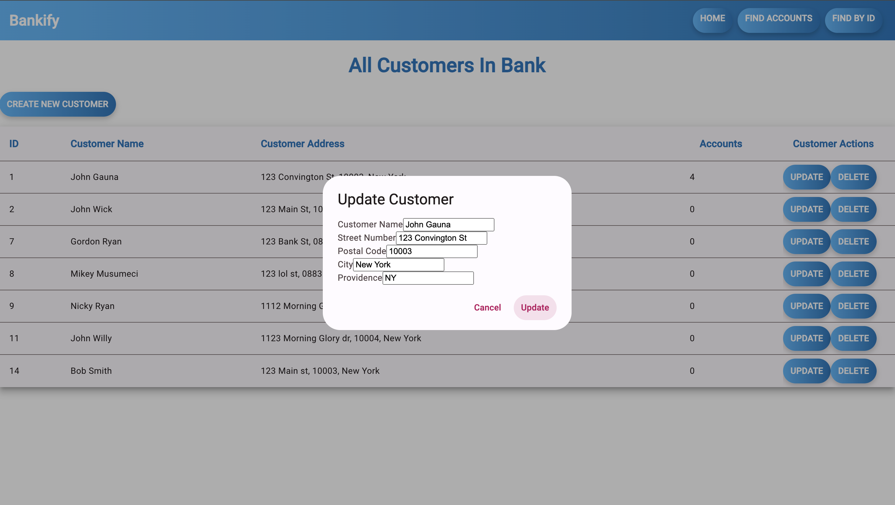
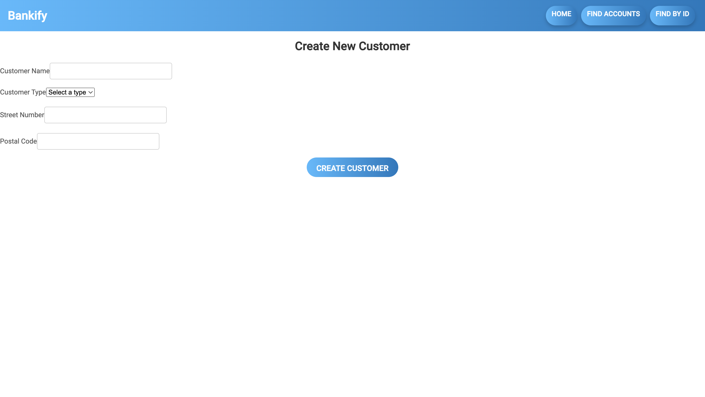
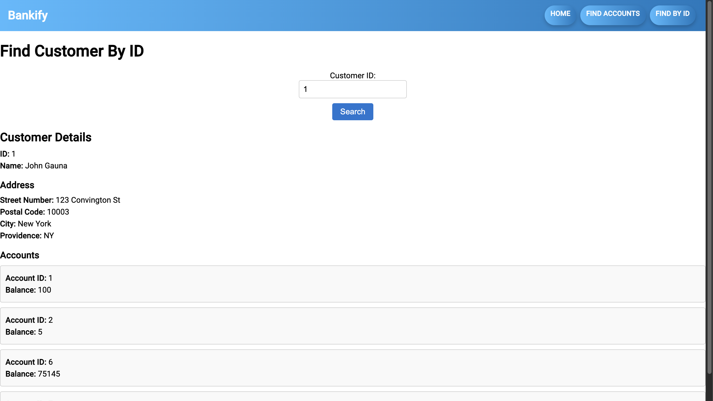
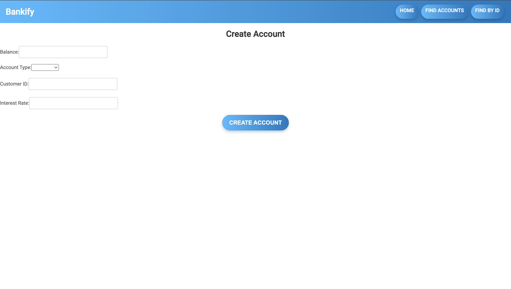

# BankAccountApplication

This project was generated with [Angular CLI](https://github.com/angular/angular-cli) version 18.1.2.

## Development server

Run `ng serve` for a dev server. Navigate to `http://localhost:4200/`. The application will automatically reload if you change any of the source files.

## Code scaffolding

Run `ng generate component component-name` to generate a new component. You can also use `ng generate directive|pipe|service|class|guard|interface|enum|module`.

## Build

Run `ng build` to build the project. The build artifacts will be stored in the `dist/` directory.

## Running unit tests

Run `ng test` to execute the unit tests via [Karma](https://karma-runner.github.io).

## Running end-to-end tests

Run `ng e2e` to execute the end-to-end tests via a platform of your choice. To use this command, you need to first add a package that implements end-to-end testing capabilities.

## Components

### HomeComponent

The `HomeComponent` displays a list of customers in a table format. It provides functionality to update and delete customers through a dialog.

- **Key Features**:
  - Fetches and displays customers.
  - Opens a dialog to update customer details.
  - Deletes a customer.

<!--  -->

### UpdateCustomerDialog

The `UpdateCustomerDialog` component is used within a dialog to update customer information. It provides a form with fields for customer details and address.

- **Key Features**:
  - Displays a form for updating customer information.
  - Allows cancellation or submission of updates.

### CreateCustomerComponent

The `CreateCustomerComponent` handles the creation of new customers. It provides a form to input customer details and address, then posts this information to the backend.

- **Key Features**:
  - Provides a form to input new customer data.
  - Submits the data to create a new customer.

### FindByIdComponent

The `FindByIdComponent` retrieves and displays customer information based on a given ID.

- **Key Features**:
  - Retrieves customer information by ID.
  - Displays the customer data.

### CreateAccountComponent

The `CreateAccountComponent` manages the creation of new accounts. It includes a form to input account details and specifies account type with additional fields for savings or checking accounts.

- **Key Features**:
  - Provides a form to input account details.
  - Allows for the creation of savings or checking accounts with specific fields.

### AccountsdirectoryComponent

The `AccountsdirectoryComponent` displays a list of all accounts, showing their ID, balance, and associated customer name.

- **Key Features**:
  - Displays a table of all accounts.
  - Allows navigation to create new accounts.

<!--  -->

## Services

### CustomerService

The `CustomerService` handles HTTP requests related to customer data, including creating, fetching, updating, and deleting customers.

- **Key Methods**:
  - `post(customerForm: any)`: Create a new customer.
  - `getCustomerById(id: number)`: Fetch customer by ID.
  - `getAllCustomers()`: Fetch all customers.
  - `updateCustomer(updatedCustomer: any)`: Update customer information.
  - `deleteCustomer(customer: any)`: Delete a customer.

<!--  -->

### AccountService

The `AccountService` manages HTTP requests for account-related operations, including creating and fetching accounts.

- **Key Methods**:
  - `post(account: any)`: Create a new account.
  - `getAllAccounts()`: Fetch all accounts.

<!--  -->

## Further help

To get more help on the Angular CLI use `ng help` or go check out the [Angular CLI Overview and Command Reference](https://angular.dev/tools/cli) page.
 # Bank Account Management System

This project is a simple Bank Account Management System implemented using Java, Spring Boot, and JPA. It includes various classes to model customers, accounts, and addresses, providing basic CRUD operations and services to manage customers and their accounts.

## Table of Contents
- [Classes Overview](#classes-overview)
  - [Account](#account)
  - [SavingsAccount](#savingsaccount)
  - [CheckingAccount](#checkingaccount)
  - [Customer](#customer)
  - [Person](#person)
  - [Company](#company)
  - [Address](#address)
- [Service Layer](#service-layer)
  - [CustomerService](#customerservice)
  - [AccountService](#accountservice)
- [Repository Layer](#repository-layer)
  - [CustomerRepository](#customerrepository)
- [Controller Layer](#controller-layer)
  - [AccountController](#accountcontroller)
  - [CustomerController](#customercontroller)
- [How to Run](#how-to-run)

## Classes Overview

### Account
The `Account` class is an abstract entity that represents a bank account. It is the base class for other types of accounts.
- **Attributes:**
  - `id` (long): Unique identifier for the account.
  - `balance` (double): The current balance of the account.
  - `customer` (Customer): The customer who owns the account.

### SavingsAccount
The `SavingsAccount` class extends the `Account` class and represents a savings account.
- **Attributes:**
  - `interestRate` (double): The interest rate applied to the savings account.

### CheckingAccount
The `CheckingAccount` class extends the `Account` class and represents a checking account.
- **Attributes:**
  - `nextCheckNumber` (int): The number of the next check to be issued.

### Customer
The `Customer` class is an abstract entity that represents a customer of the bank.
- **Attributes:**
  - `customerId` (long): Unique identifier for the customer.
  - `name` (String): The name of the customer.
  - `address` (Address): The address of the customer.
  - `accounts` (List<Account>): A list of accounts owned by the customer.

### Person
The `Person` class extends the `Customer` class and represents an individual customer.
- **Attributes:**
  - Inherits all attributes from `Customer`.

### Company
The `Company` class extends the `Customer` class and represents a corporate customer.
- **Attributes:**
  - Inherits all attributes from `Customer`.

### Address
The `Address` class represents the address associated with a customer.
- **Attributes:**
  - `addressId` (long): Unique identifier for the address.
  - `streetNumber` (String): The street number of the address.
  - `postalCode` (String): The postal code of the address.
  - `city` (String): The city of the address.
  - `providence` (String): The province of the address.
  - `customer` (Customer): The customer associated with the address.

## Service Layer

### CustomerService
The `CustomerService` class provides services for managing customers, including creating, updating, and deleting customers, and finding customers by ID or type.

### AccountService
The `AccountService` class provides services for managing accounts, including creating accounts and retrieving accounts based on various criteria.

## Repository Layer

### CustomerRepository
The `CustomerRepository` interface extends `JpaRepository` and provides methods for querying customers from the database, including finding all customers in a specific city or of a specific type.

## Controller Layer

### AccountController
The `AccountController` class handles HTTP requests related to accounts, such as creating accounts and retrieving all accounts or accounts of customers in a specific city.

### CustomerController
The `CustomerController` class handles HTTP requests related to customers, such as creating, updating, and deleting customers, and retrieving customers by ID or type.

## How to Run

1. Clone the repository.
2. Open the project in your favorite IDE.
3. Ensure that you have Java and Maven installed on your system.
4. Run the application using the command:
5. The application will start on `http://localhost:8080`.

## Endpoints

### Account Endpoints
- `POST /accounts`: Create a new account.
- `GET /accounts`: Retrieve all accounts.
- `GET /accounts/by-city-in-toronto`: Retrieve all accounts of customers in Toronto.

### Customer Endpoints
- `POST /customer`: Create a new customer.
- `GET /customers`: Retrieve all customers.
- `GET /customer/{id}`: Retrieve a customer by ID.
- `PUT /customer/{id}`: Update a customer's details.
- `DELETE /customer/{id}`: Delete a customer by ID.
- `GET /persons`: Retrieve all Person-type customers.
- `GET /companies`: Retrieve all Company-type customers.

